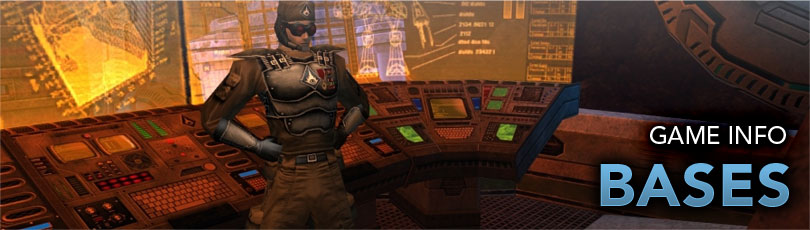

# Bases

Bases are used by Super Groups to congregate, pool resources, travel easier, and more. They were introduced and restricted to the Villains expansion until the two were merged. Bases serve as a fun and useful money sink.

## Prestige

All modifications and rent are paid for in Prestige. Prestige is earned instead of Inf when switching to Super Group Mode or Exchanged for Inf at the Super Group Registrar desks in Atlas Park, or Galaxy City (hero side) and Port Oakes (villain side).

- The exchange rate is 1,000,000 Inf for 2,000 prestige.
- Ideally, a higher level player with enough Inf would want to switch to Super group Mode.

### Rent

Rent is calculated every four week for each base. Rent is an in-game charge to Super Groups based on certain items they posses in their bases. Similarly to exchanging Inf, paying for rent is done at the Super Group Registrar.

## Making a Functional Base

### Plot

The base plot is determined the size and how many items it may have in those rooms. Larger plot sizes allow for more rooms, ect.

### Energy and Control

Energy and Control are the only two attributes that affect how items function.

Energy is the power generation by means of technology or magic (arcane). Control is the ability to monitor and control varies devices.

While some items, such as storage or the invention worktable, do not require energy or control, the majority of non-decorative items require some of each. Fall of short in either category and things will stop working.

### Core and Auxiliary Items

Core or primary items operate on their own. Some require energy, control, or both to function, but they will draw from the base; source is not important. Most if not all, core items connect to them.

Auxiliary items need Core items to function. They must be placed in a room that has an item of a type to connect to but does not need to be directly near it. Each Core item will only connect to a set maximum number of auxiliary items.

## External Links

- [Supergroup Base](https://archive.paragonwiki.com/wiki/Supergroup_Base)