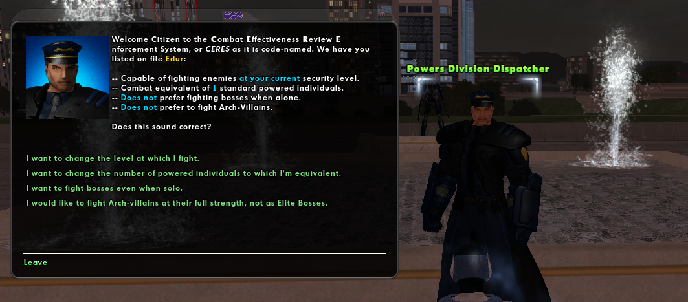

# Notoriety

**Notoriety** is a difficultly or challenge setting that affects the size and makeup of enemy spawns in (door) missions that *haven't* been started.

## Contacts

You can change your character's notoriety anywhere in the game by interacting with a notoriety contact. Each contact goes under a different agency, organization, or division, depending on the setting. Rouge has the most diverse set.

| Contact                      | Setting      | Expansion |
| ---------------------------- | ------------ | --------- |
| Field Analyst                | Paragon City | Base      |
| Fortunata Fateweaver         | Rogue Isles  | Villains  |
| Powers Division Dispatcher   | Praetoria    | Rouge     |
| Resistance Operative Handler | Praetoria    | Rouge     |
| Mistress of Fate             | Praetoria    | Rouge     |

## Spawns

The primary factors it affects the spawn size and makeup include the experience level of the character when the mission was assigned based on the character's notoriety and number of team members.

Spawns are at their lowest in missions attempt by a solo player, generating three minions or a minion and a lieutenant. Two players will have three to give minions and a lieutenant, potentially one level higher. Players with higher notoriety produce greater spawns and sometimes bosses above the number placed by the mission designer.

### Architect Entertainment

Notoriety also affects spawns at  Architect Entertainment in the same way as standards missions. For example, if the character has opted to fight Archvillains or Heroes at Elite Boss difficulty, Archvillains and Heroes in Mission Architect missions will spawn at the Elite Boss rank instead.

## External Links

- [Notoriety](https://archive.paragonwiki.com/wiki/Notoriety)