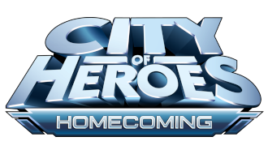

# Introduction

A condescend guide to City of Heroes based on the [Paragon Wiki](https://archive.paragonwiki.com) that targets [Homecoming](https://forums.homecomingservers.com/)'s private servers.

City of Heroes was home to an entire multiverse of superpowered beings in a stunning, 3D graphical world. Hundreds of thousands of players took on the roles of heroes, villains, vigilantes, and rogues, while both saving and destroying worlds. City of Heroes was known for its groundbreaking level of customization, its highly community-focused features, and its abundant developer-player interaction and feedback.
