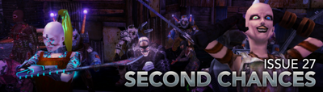
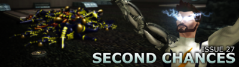
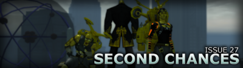
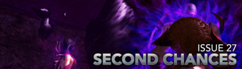

# Issue 27

Issue 27 is the second major release for Homecoming.

## Major Changes

- Sonic, Seismic Blast and Earth Manipulation manipulation
- Asymmetrical customization options
- Tour guide missions
- Dr. Aeon Strike Force
- Permanent NPC Costume Power Rewards
- [Name Release - Phase 1: Warning Mode](https://forums.homecomingservers.com/topic/36519-focused-feedback-name-release-policy-phase-1-warning-mode/)

## Highlights

### Page 1

- Two new story arcs featuring new characters, enemies, mission maps, badges and mechanics
- A new powerset: Sonic Manipulation
- Asymmetrical shoulder pads, stance selection, and sprint customization
- Reworks for Energy Melee, Titan Weapons, Teleportation, Trick Arrow and Blaster Secondaries
- Energy Melee for Scrappers
- Tons of improvements for PvP, including 9 new arena maps
- Expanded gamepad support
- A whole host of improvements, balance changes, and fixes

## Page 2

- Tour Guide Missions
- Travel Power Updates
- Power Changes
- PvP Changes
- Coordinates and /thumbtack commands
- A whole host of improvements, balance changes, and fixes

### Page 3

- Dr. Aeon Strike Force
- Difficulty/Challenge Options
- Powersets: Seismic Blast and Earth Manipulation
- Proliferation: Scrappers and Stalkers Stone Melee and Stone Armor
- Revamps: Stone Armor, Electrical Blast, and Dual Blades
- IO Sets: Slow Movement and Travel
- D-Sync Origin Enhancements
- New Emotes
- Base Items
- Costume Parts

### Page 4

- Marquee Features
  - New Incarnate Mission Content: Sister Valeria
  - New Powersets - Symphony Control, Sonic Assault
  - Name Release Policy - Phase 1: Warnings
  - New Advanced Difficulty - Imperious Task Force
  - Advanced Difficulty Improvements & New Reward Currency
  - Permanent NPC Costume Power Rewards
- Powers & Gameplay Adjustments
  - Enemy Aggro Revamp
  - Attack Typing Adjustments
  - New Tech: Power Toggle Suspension
  - Temporal Warriors, Instant Level 50 PvP Characters
- Character Customization Improvements
  - Sheathed Weapons System
  - Custom Weapons Expansion
  - Costume Part Proliferation & Fixes
  - Arachnos Widow Costume Update
  - Parkour and Blitz Movement Stances
  - Walk Animation Customization
- Various Additions & Enhancements
  - New Badges
  - Cimerora Tour Guides
  - Proliferated Emotes
  - New Roleplaying & System Commands
  - New AE Mission Maps, NPCs, Custom Enemy Powersets, and new Advanced Enemy Customization
  - Fort Trident & The Crucible Revamp
  - Roleplaying Pub(V) and Luau(H) Area Additions